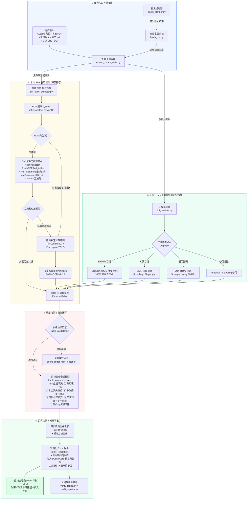

# 📊 Zotero Table Extractor

<p align="center">
  
</p>

<p align="center">
  <b>一站式学术文献结构化表格智能提取系统</b><br/>
  从 Zotero 选中条目、本地 PDF、期刊网页或 DOI 中自动定位、识别、核验并提取复杂科学表格，导出为出版级 Excel (<code>.xlsx</code>)。
</p>

<p align="center">
  <a href="#-核心能力"></a>
  <a href="#-多方投票仲裁"></a>
  <a href="#-两阶段视觉-ai-接管"></a>
  <a href="#-环境要求"></a>
  <a href="#-环境要求"></a>
</p>

---

## 📑 目录

- [💡 项目简介](#-项目简介)
- [✨ 核心能力](#-核心能力)
  - [1. 优先在线 HTML/XML 高保真提取](#1-优先在线-htmlxml-高保真提取)
  - [2. 本地原生 PDF 5 引擎投票共识](#2-本地原生-pdf-5-引擎投票共识)
  - [3. 复杂扫描件/无框表两阶段视觉 AI 接管](#3-复杂扫描件无框表两阶段视觉-ai-接管)
  - [4. 7 阶轻量安全后处理流水线](#4-7-阶轻量安全后处理流水线)
  - [5. 跨页续表与横向分块自适应拼接](#5-跨页续表与横向分块自适应拼接)
  - [6. 出版级规范 Excel 导出](#6-出版级规范-excel-导出)
  - [7. 全库批量并发与工业级鲁棒性](#7-全库批量并发与工业级鲁棒性)
- [🏗 架构设计与数据流转图](#-架构设计与数据流转图)
- [💻 环境要求与安装](#-环境要求与安装)
- [⚙️ 配置指南](#️-配置指南)
  - [1. 跨平台路径与环境交互式配置向导 (setup_paths.py)](#1-跨平台路径与环境交互式配置向导强烈推荐)
  - [2. 配置文件手动初始化 (config.json)](#2-配置文件手动初始化-configjson)
  - [3. 环境变量优先支持](#3-环境变量优先支持)
  - [4. 详细配置项说明](#4-详细配置项说明)
  - [5. 技能在线更新与配置防护机制 (update.py)](#5-技能在线更新与配置防护机制-updatepy)
  - [6. 各种 API 获取方式](#6-各种-api-获取方式)
  - [7. 期刊与知网登录向导 (login.py)](#7-期刊与知网登录向导-loginpy)
- [🚀 使用方法](#-使用方法)
  - [单篇 PDF 表格提取](#单篇-pdf-表格提取)
  - [在线文献 URL / DOI 提取](#在线文献-url--doi-提取)
  - [目录批量与路径清单批量提取](#目录批量与路径清单批量提取)
  - [Zotero 全库一键批量提取](#zotero-全库一键批量提取)
  - [结合 AI Agent / MCP 编排调用](#结合-ai-agent--mcp-编排调用)
  - [表格提取质量核验与清理](#表格提取质量核验与清理)
- [📂 文件结构](#-文件结构)
- [🙏 鸣谢与参考开源项目](#-鸣谢与参考开源项目)
- [📄 开源协议与免责声明](#-开源协议与免责声明)

---

## 💡 项目简介

学术文献（尤其是地学、材料、化学、生物、医学等自然科学领域）中的表格往往存在**无边框/三线表、跨行跨列单元格、多数值挤压排版、上下标与正负公差、多级复合表头以及跨页续表（Continued tables）**等极为复杂的排版特征。传统的单一工具（如纯 Camelot 或单纯 OCR）在面对上述排版时极易发生串行、漏列、公式错乱或数据缺失。

**Zotero Table Extractor** 是一套端到端的学术表格智能提取与重构引擎：
1. **双轨驱动**：优先走官方直连 API / 原生 HTML / XML 提取（100% 零误差），若缺失或受阻则无缝降级到本地 PDF 深度流水线；
2. **多方验证**：原生文本 PDF 采用 5 引擎多方投票与矩阵相似度交叉仲裁；
3. **视觉多模态大模型**：对于扫描件、低置信度表格或复杂表，采用 **PP-StructureV3 / DocLayout-YOLO** 前置定位与切图，串联 **PaddleOCR-VL-1.6** 多模态大语言模型进行结构化还原；
4. **精细后处理**：内置 7 阶轻量安全清洗流水线（防 Excel 注入、多行子行展开、紧缩数值拆分、多级表头重塑等），并自动拼接跨页续表，最终交付排版整洁、格式标准、附带规范表号表题的 Excel 产物。

---

## ✨ 核心能力

### 1. 优先在线 HTML/XML 高保真提取
- **Elsevier 官方 XOCS XML 直连**：通过官方 API 直取原生 XML 数据节点，数学符号与行列结构保真度达 100%。
- **多出版商自适应分流**：原生覆盖 Elsevier / ScienceDirect、Springer Link、Wiley、Nature、IEEE Xplore、Taylor & Francis、MDPI、ACS、RSC、GeoSciWorld 等。
- **中国知网 (CNKI) 专属适配**：内置 Scrapling 极速爬取与 Playwright 动态渲染引擎，支持滑块验证码绕过、地质特殊符号还原及文献 HTML 阅读页表格提取。
- **附表 (Supplementary Tables) 自动探测**：自动嗅探并提取论文正文及关联的在线附表。
- **完备性门禁**：若在线提取得到的表数量低于 PDF 文本层扫描出的表格 caption 数量，系统自动触发增量补偿，防止在线版本漏表。

### 2. 本地原生 PDF 5 引擎投票共识
对于含有完整矢量文本层的 Native PDF，启动多算法交叉核验，兼顾极速与极高准确率（单页约 0.1s）：
- **`pdf-inspector`**：Rust 编写的高性能检测器，快速判定 PDF 类型并解析 Markdown 表格；
- **`PyMuPDF find_tables()`**：极速矢量线框表格识别；
- **`text_alignment`**：基于文字坐标聚类分列的无线框对齐引擎；
- **`pdfplumber`**：基于字符空间矩形与相交线框的结构提取；
- **`Camelot`**：Lattice 网格法与 Stream 文本流双策略识别；
- **双向相似度投票仲裁**：计算矩阵相似度，任意两方相似度 $\ge 0.75$ 则判定一致并采纳最佳版本；相似度 $< 0.90$ 标记为低置信度并触发视觉 AI 介入。

### 3. 复杂扫描件/无框表两阶段视觉 AI 接管
针对扫描版 PDF、混合排版以及低置信度复杂页：
- **前置表格定位与切图**：
  - 在线模式：调用百度 **PP-StructureV3** 版面分析模型，毫秒级定位页面内表格 Bounding Box 并高精度裁切；
  - 离线/兜底模式：内置 **DocLayout-YOLO**（DocStructBench 8位量化 ONNX 权重，约 19MB），无网环境下本地完成目标检测。
- **高精度多模态重构**：
  - 将表格定位区域或全页送入 **PaddleOCR-VL-1.6** 多模态大模型；
  - 输出精准的 HTML `<table>` 与 Markdown 结构，轻松应对跨行跨列合并单元格、旋转表格与倾斜扫描件。
- **严格边界防污染截断**：
  - 提取算法严格隔离相邻表格的 Caption 范围，彻底消除连续表跨表重叠与串表污染；中英文双语表题优先保留真实 Caption。

### 4. 7 阶轻量安全后处理流水线
提取出的原始表格在导出前经过严格的 7 阶清洗与规范化：
1. **阶段 A（VLM 直通保护）**：保护高精度 MultiIndex 表头，不盲目切片，仅执行 LaTeX 语法与 OCR 乱码清洗（如 `\pm`, `\times` 规范化、零宽字符过滤）；
2. **阶段 B（碎片表门禁）**：列数 $> 30$ 且填充率 $< 30\%$ 的低质量碎片表直接拦截剔除；
3. **阶段 C（表头探测与复合重构）**：扫描前 80 行寻找真实科学关键词（如样品号、含量、参数等），剥离误卷入的正文段落与页眉，展平并合并两级复合表头（`Parent_Child`）；
4. **阶段 D（单元格挤压展开）**：
   - `expand_squeezed_columns`：智能拆分因 OCR 粘连而挤在单个单元格内的多个连续数值；
   - `expand_multiline_subrows`：展开单元格内多行子项；
   - `populate_section_categories`：向下填充继承地质层位、样品组别等区域分组头；
5. **阶段 E（公式注入防御与数值类型推断）**：
   - 自动推断整型、浮点型，保留地学有效数字；
   - **Excel 公式注入防御**：检测以 `=`, `+`, `-`, `@` 开头的单元格内容，自动前置单引号 `'` 转义，杜绝 Excel 打开时的恶性宏执行或公式报错；
6. **阶段 F（噪声与付费墙过滤）**：清除 `Unnamed` 占位符、移除页底版权声明、水印与付费墙截断提示；
7. **阶段 G（表号与表题规范化）**：统一抽取标准表号（`Table 1`、`表2` 等），并在元数据中保留中英文完整标题。

### 5. 跨页续表与横向分块自适应拼接
- **纵向跨页续表合并**：自动识别 `Table 1 (continued)`、`表1 (续)` 或紧随其后的同列构型无头表格，自动执行上下拼接，生成单一完整表格；
- **横向分块表格合并**：自动识别因页面宽度受限而被横向拆分为两部分的数据表（如 `Table 4 Part 1` 与 `Table 4 Part 2`），按行索引精准水平拼接；
- **对齐与边缘保护**：自适应对齐列名，对于行数 $< 3$ 的小型表开启边缘保护，杜绝误判误删。

### 6. 出版级规范 Excel 导出
- **视觉主题定制**：深色表头底色、清晰加粗白字、交替行斑马纹浅灰底、精细灰色线框；
- **动态列宽自适应**：智能采样前 200 行文本长度，自动计算最佳列宽并限制上下边界，告别 `###` 遮挡；
- **元数据完美注入**：写入 Dublin Core 与 Office 标准核心属性，在 macOS Finder QuickLook（按空格键即时预览）以及 Windows 资源管理器中均能获得原生级预览；
- **双轨导出模式**：
  - **分表独立输出**：以 `Table 1.xlsx`、`Table 2.xlsx` 独立存放于专属论文目录，附带 `table_captions.txt` 目录索引清单；
  - **单文件多 Sheet 输出**：将整篇论文所有表格汇聚于单个 `.xlsx` 文件中的多个 Sheet。

### 7. 全库批量并发与工业级鲁棒性
- **只读 SQLite 快照克隆**：在扫描 Zotero 数据库时自动克隆临时副本，彻底消除 SQLite `database is locked` 读写冲突；
- **子进程完全隔离**：全库遍历采用独立的 Python 子进程并发执行，单篇文献的解析超时（内置熔断机制）或异常绝不波及主进程与其他文献；
- **断点续传与执行计划**：内置 `batch_planner.py` 预分析文献年份与元数据（自动区分知网老文献直通本地管线），支持断点跳过已提取文献。

---

## 🏗 架构设计与数据流转图



> **说明**：项目工程中提供了更加详尽的原生矢量全景架构图源文件，可使用 draw.io 打开并编辑：  
> - 📄 [figures/zotero_table_extractor_architecture.drawio](figures/zotero_table_extractor_architecture.drawio)
> - 🖼 [figures/zotero_table_extractor_architecture.svg](figures/zotero_table_extractor_architecture.svg)
> - 🖼 [figures/zotero_table_extractor_architecture.png](figures/zotero_table_extractor_architecture.png)

---

## 💻 环境要求与安装

### 1. 基础环境
- **操作系统**：macOS (Apple Silicon / Intel)、Linux、Windows 10/11
- **Python 版本**：Python 3.9 及以上（推荐 Python 3.10 或 3.11）
- **包管理器**：推荐使用极速包管理器 [uv](https://github.com/astral-sh/uv) 或原生 `pip`

### 2. 系统底层依赖（可选但推荐）
若需要启用 Camelot 的 PDF 提取支持，建议安装 Ghostscript：
- **macOS**：
  ```bash
  brew install ghostscript tesseract
  ```
- **Ubuntu / Debian**：
  ```bash
  sudo apt update && sudo apt install -y ghostscript libgl1-mesa-glx tesseract-ocr
  ```
- **Windows**：
  可通过安装 [Ghostscript 官方安装包](https://ghostscript.com/releases/gsdnld.html) 并将其 `bin` 路径加入系统环境变量 `PATH`。

### 3. 安装 Python 依赖

克隆本仓库到本地后，在根目录下安装核心依赖：

```bash
git clone https://github.com/ZRyanX/zotero-table-extractor.git
cd zotero-table-extractor

# 推荐使用 uv 极速安装
uv pip install -r requirements.txt

# 或使用标准 pip
pip install -r requirements.txt
```

### 4. 安装 Playwright 浏览器内核（用于在线期刊渲染）
```bash
playwright install chromium
```

### 5. 本地视觉模型准备
项目在 `models/` 目录下默认配备了 `doclayout-yolo-docstructbench-q8-6c25a56c.onnx`（约 19.5MB）。若未找到，脚本会在首次运行检测时自动下载，或可手动放置于 `models/` 或 `~/.zotero_models/`。

---

## ⚙️ 配置指南

### 1. 跨平台路径与环境交互式配置向导（强烈推荐）

本项目提供了开箱即用的跨平台路径自定义与环境初始化脚本 `setup_paths.py`，无论您使用的是 macOS 还是 Windows，均可直接运行该向导，自动探测 Zotero 安装与数据路径，并自定义所有输入输出目录：

```bash
# 1. 启动交互式引导向导（推荐）
python setup_paths.py

# 2. 或一键自动探测并保存系统推荐默认路径
python setup_paths.py --auto

# 3. 随时检查当前各项路径配置与有效性状态
python setup_paths.py --show

# 4. 如需重置为官方空白模板
python setup_paths.py --reset
```

> **💡 向导特性**：
> - 自动探测 macOS (`~/Zotero`) 与 Windows (`%USERPROFILE%\Zotero`) 数据库及附件库；
> - 支持自定义表格 Excel 导出主目录（如外置硬盘、指定数据盘 `D:\paper_tables` 或工程目录）；
> - 自动校验输入路径合法性，并支持一键自动创建缺失的输出目录；
> - 可选在向导中直接配置飞桨 AIStudio、Elsevier、Firecrawl 等在线 API 密钥；
> - 配置安全写入受 `.gitignore` 严密保护的 `config.json`，绝不污染 Git 提交。

### 2. 配置文件手动初始化 (config.json)

如果您希望手动编辑配置文件，可在项目根目录下复制模板：

```bash
cp config.example.json config.json
```

> [!IMPORTANT]  
> **隐私与安全保护**：`config.json` 包含您的私有 API 密钥与个人用户目录，已被 `.gitignore` 保护，**严禁提交入库**。上传代码前请确保所有个人信息均留在未跟踪的 `config.json` 中。

### 3. 环境变量优先支持
所有关键 API 密钥与路径均支持通过系统环境变量直接注入，非常适合在 CI/CD、Docker 或受保护的服务器环境中使用：
- `export PAPER_TABLES_DIR="/path/to/your/output"`
- `export ZOTERO_DIR="/path/to/your/Zotero"`
- `export FIRECRAWL_API_KEY="your-firecrawl-api-key"`
- `export ELSEVIER_API_KEY="your-elsevier-api-key"`
- `export PADDLEOCR_ACCESS_TOKEN="your-aistudio-access-token"`
- `export OPENAI_API_KEY="your-llm-api-key"`

### 4. 详细配置项说明

以下是 `config.json` 中的完整参数列表及说明：

| 配置 Key | 类型 | 默认值 / 推荐值 | 作用说明 |
| :--- | :--- | :--- | :--- |
| `PAPER_TABLES_DIR` | string | `~/paper_tables` | 表格提取成果、批处理日志与质检数据库的主输出目录 |
| `ZOTERO_DIR` | string | `~/Zotero` | 本地 Zotero 数据主目录（Windows 对应 `%USERPROFILE%\Zotero`） |
| `ZOTERO_DB_PATH` | string | `<ZOTERO_DIR>/zotero.sqlite` | Zotero 核心 SQLite 数据库物理文件路径 |
| `ZOTERO_STORAGE_DIR` | string | `<ZOTERO_DIR>/storage` | Zotero 论文 PDF 物理附件存储根目录 |
| `PLAYWRIGHT_USER_DATA_DIR` | string | `~/.zotero_playwright_profile` | 浏览器 Profile 目录（持久化知网与期刊登录 Cookie 会话） |
| `DOCLAYOUT_MODEL_DIR` | string | `"./models"` | 本地离线 DocLayout-YOLO 模型权重存放目录 |
| `FIRECRAWL_CACHE_DIR` | string | `~/.zotero_firecrawl_cache` | 网页提取离线缓存目录 |
| `SUPP_DOWNLOADER_SCRIPT` | string | `""` | [可选] 外部附表下载技能脚本路径 (`journal_downloader.py`) |
| `PADDLEOCR_MCP_AISTUDIO_ACCESS_TOKEN` | string | `""` | 百度 AIStudio 访问令牌，用于调度 PP-StructureV3 与 PaddleOCR-VL-1.6 |
| `PADDLEOCR_MCP_MODEL` | string | `"PaddleOCR-VL-1.6"` | 视觉语言大模型名称 |
| `PP_STRUCTURE_MODEL` | string | `"PP-StructureV3"` | 版面分析与表格定位模型名称 |
| `USE_PP_STRUCTURE` | boolean | `true` | 是否启用 PP-Structure 作为表格前置定位 |
| `ELSEVIER_API_KEY` | string | `""` | Elsevier 机构官方 API Key，用于直取 ScienceDirect 原生 XOCS XML |
| `FIRECRAWL_API_KEY` | string | `""` | Firecrawl 智能爬虫 API Key（用于通用网页清洗） |
| `FIRECRAWL_MAX_AGE_MS` | int | `86400000` | Firecrawl 网页缓存生命周期（毫秒，默认 24h） |
| `CNKI_STRATEGY` | string | `"auto"` | 知网提取策略：`auto`（自动尝试）、`scrapling`、`playwright` |
| `PLAYWRIGHT_HEADED` | boolean | `false` | 是否以可见窗口启动浏览器（调试或人工验证时设为 `true`） |
| `DOCLAYOUT_YOLO_ENABLED` | boolean | `true` | 是否启用本地 DocLayout-YOLO 视觉版面检测兜底 |
| `DOCLAYOUT_CONF_THRESHOLD` | float | `0.25` | YOLO 目标检测置信度阈值 |
| `LLM_ENABLED` | boolean | `false` | 是否启用 LLM 辅助自愈与复杂语义推断 |
| `LLM_API_BASE` | string | `"https://api.openai.com/v1"` | LLM 服务端点地址（兼容 OpenAI 规范） |
| `LLM_API_KEY` | string | `""` | LLM 身份认证密钥 |
| `LLM_MODEL` | string | `"gpt-4o-mini"` | LLM 纠错选用的模型名称 |

### 4. 各种 API 获取方式

#### 1. 百度飞桨 AIStudio Access Token（强烈推荐，用于 PP-StructureV3 与 PaddleOCR-VL-1.6）
1. 访问 [百度飞桨 AIStudio](https://aistudio.baidu.com/) 并登录百度账号；
2. 进入个人中心 -> **访问令牌 (Access Token)** -> 点击 **创建令牌**；
3. 将生成的 Token 填入 `config.json` 的 `PADDLEOCR_MCP_AISTUDIO_ACCESS_TOKEN`，或导出为环境变量 `PADDLEOCR_ACCESS_TOKEN`。

#### 2. Elsevier ScienceDirect API Key（推荐高校/科研机构人员配置）
1. 访问 [Elsevier Developer Portal](https://dev.elsevier.com/) 并注册账号；
2. 点击 **Create API Key**，输入应用名称与所在机构域名；
3. 将生成的 API Key 填入 `config.json` 的 `ELSEVIER_API_KEY`。配置后可直接以 100% 数字保真度提取 Elsevier 旗下所有论文的表格。

#### 3. Firecrawl API Key（可选）
1. 访问 [Firecrawl 官网](https://www.firecrawl.dev/) 注册并获取 API Key；
2. 填入 `config.json` 的 `FIRECRAWL_API_KEY`。

### 5. 技能在线更新与配置防护机制 (update.py)

为了确保用户能够始终享受到上游算法优化与功能修复，同时**绝对杜绝更新时覆盖用户配置好的 API 密钥与个人目录（如 Zotero 数据路径、Excel 导出目录、本地模型等）**，本项目内置了企业级的在线更新与个人配置绝对保护引擎：

#### 🌟 核心防护特性
1. **零覆盖保证 (Zero-Overwrite)**：无论远端代码如何迭代，现有 `config.json` 中的所有个人凭据（`FIRECRAWL_API_KEY`、`ELSEVIER_API_KEY`、`PADDLEOCR_MCP_AISTUDIO_ACCESS_TOKEN`、`LLM_API_KEY` 等）与个性化路径绝对 100% 保持原样；
2. **智能双向合并 (Intelligent 2-Way Merge)**：上游 `config.example.json` 若引入了新的特性参数，引擎会自动检测并无缝增量补充进用户的 `config.json` 中，无需用户手动对比复制；
3. **多版本自动快照与一键回滚 (Rollback)**：每次更新前，系统会在 `.backups/` 目录中建立带时间戳的全量快照与校验 Manifest。如遇异常或需退回，只需一条命令即可毫秒级回滚；
4. **Git 与 Release 归档双模支持**：
   - **Git 环境**：自动探测分支、安全 Stash 本地已跟踪修改、执行快进合并；
   - **免 Git / ZIP 部署环境**：自动从 GitHub Releases / Archive 拉取最新稳定归档包，遵循白名单过滤机制，绝对屏蔽并保护 `config.json`、`profiles/`、本地模型与用户数据库；
5. **凭据脱敏核验单**：更新后在终端高亮打印脱敏核验清单，直观确认各项私有密钥毫发无损。

#### 常用更新命令参考

```bash
# 1. 一键在线安全更新（自动检测、安全拉取、配置智能合并）
python update.py
# 或通过配置向导调用：
python setup_paths.py --update

# 2. 仅检查远端是否有新版本及本地是否缺失新配置项（只读安全探测）
python update.py --check
# 或：
python setup_paths.py --check-update

# 3. 演练模式（Dry-run 模拟更新全流程，不修改任何磁盘文件）
python update.py --dry-run

# 4. 回滚至最近一次备份的配置状态
python update.py --rollback

# 5. 列出所有历史配置快照列表
python update.py --list-backups

# 6. 仅同步 config.example.json 最新模板项进 config.json（不拉取代码）
python update.py --merge-only

# 7. 更新后自动升级 Python 运行依赖
python update.py --install-deps

# 8. 以结构化 JSON 输出结果（专为 Agent、MCP 工具与自动化脚本设计）
python update.py --check --json
```

### 6. 期刊与知网登录向导 (login.py)

为了让爬虫能够下载或查看机构订阅的高校数据库（如知网、Springer、Wiley），项目提供了统一的交互式登录与 Cookie 保持向导：

```bash
# 1. 知网快捷登录并自动抓取保存 Cookies
python scripts/login.py cnki

# 2. 主流学术出版社 Chrome 调试端口桥接登录
python scripts/login.py publishers

# 3. Crawl4AI 模式登录
python scripts/login.py crawl4ai
```

登录完成后，Cookies 会自动持久化到本地用户配置目录，后续提取管线将全自动复用已登录会话。

---

## 🚀 使用方法

### 单篇 PDF 表格提取

最基础的用法，直接传入本地 PDF 路径并指定输出路径：

```bash
python scripts/extract_zotero_table.py \
  --pdf "/path/to/paper.pdf" \
  --output "/path/to/output_dir"
```

**高级选项参数**：
- `--single-file`：启用单文件汇总模式，将整篇论文所有表格输出至单个 `.xlsx` 文件的多个 Sheet 中（也可直接将 `--output` 指定为以 `.xlsx` 结尾的文件路径）；
- `--enable-llm`：开启 LLM 复杂语义推断与表格残损自愈（需在 `config.json` 或环境变量中配置 `OPENAI_API_KEY` 或兼容服务）；
- `--headers "Col1,Col2,Col3"`：手动指定或修正表头列名；
- `--table-idx 0`（或 `all`）：仅提取第 1 张表（从 0 开始），或提取全部表格；
- `--pdf-only`：跳过任何在线探测，强制走本地 PDF 深度提取流水线；
- `--online-only`：仅尝试在线 HTML/XML 抓取，不回退本地提取；
- `--skip-supplementary`：跳过附表/附录表格，仅提取正文核心表格；
- `--headed`：使用有头浏览器排查知网等在线渲染问题。

### 在线文献 URL / DOI 提取

无需提前下载 PDF，直接传入在线文献 URL 或 DOI：

```bash
# 通过 DOI 直接提取
python scripts/extract_zotero_table.py \
  --pdf "10.1016/j.precamres.2021.106450" \
  --output "./output"

# 通过在线文章链接提取
python scripts/extract_zotero_table.py \
  --pdf "https://link.springer.com/article/10.1007/s00126-020-00994-x" \
  --output "./output"
```

### 目录批量与路径清单批量提取

支持传入包含多个 PDF 的文件夹，或者包含 PDF 物理路径/URL 清单的 `.txt` 文件，并设置并发工作线程数：

```bash
# 1. 对整个文件夹下的所有 PDF 进行并发提取
python scripts/extract_zotero_table.py \
  --pdf "/path/to/pdf_folder" \
  --output "/path/to/output_base" \
  --workers 4

# 2. 对 .txt 清单中列出的文献批量提取
python scripts/extract_zotero_table.py \
  --pdf "paper_list.txt" \
  --output "/path/to/output_base" \
  --workers 4
```

### Zotero 全库一键批量提取

针对科研工作者的 Zotero 文库，`batch_run.py` 能够自动读取 `zotero.sqlite` 本地数据库并克隆无锁快照，对整个文库或特定分类进行全量并发提取：

```bash
python scripts/batch_run.py \
  --db-path "~/Zotero/zotero.sqlite" \
  --output "~/paper_tables" \
  --workers 4
```

- 运行中会自动记录 `batch_extraction_log.txt`；
- 支持断点续传，已成功提取的文献自动跳过；
- 每篇文献独立运行在沙箱子进程中，具备超时防挂死保护。

### 结合 AI Agent / MCP 编排调用

本技能完全遵循 Agent 架构设计规范。在 Cursor、Claude Desktop、Antigravity 等支持 Agent 工具调用的环境中：
1. 上层 Agent 通过 `ai4paper-zotero` MCP 工具（如 `zotero_get_selected_items`）获取用户当前在 Zotero 软件中选中的条目物理 PDF 路径；
2. Agent 直接调度 CLI：
   ```bash
   python scripts/extract_zotero_table.py --pdf "<Zotero物理路径>" --output "<目标路径>"
   ```
3. 提取完成后向用户直接反馈生成的规范 Excel 路径与表格预览摘要。

### 表格提取质量核验与清理

提取完成后，可对输出目录执行自动化完整性验证，清理空表或无意义碎片表：

```bash
python scripts/verify_tables.py --root "/path/to/output_dir"
```

---

## 📂 文件结构

```text
zotero-table-extractor/
├── README.md                         # 项目主说明文档（本文件）
├── SKILL.md                          # AI Agent 技能协议定义与提示词
├── update.py                         # 🔄 技能在线更新与个人配置绝对防护主入口
├── setup_paths.py                    # 🛠 跨平台路径与环境交互式初始化配置向导
├── requirements.txt                  # Python 依赖清单
├── config.json                       # 运行时私有配置 (受 .gitignore 保护，切勿提交)
├── config.example.json               # 配置文件模板
├── .gitignore                        # Git 忽略配置 (保护密钥、缓存与临时数据库)
├── figures/                          # 超清架构图工程文件与矢量导出
│   ├── zotero_table_extractor_architecture.drawio # draw.io 矢量源文件
│   ├── zotero_table_extractor_architecture.png    # 高清 PNG 架构图
│   └── zotero_table_extractor_architecture.svg    # 原生矢量 SVG 架构图
├── models/                           # 本地离线 ONNX 视觉模型目录
│   └── doclayout-yolo-docstructbench-q8-6c25a56c.onnx # 8位量化 YOLO 版面检测模型
├── scratch/                          # 临时诊断测试与试验脚本目录
└── scripts/                          # 核心源码库
    ├── updater.py                    # 🛡️ 在线安全更新与智能配置迁移/回滚引擎
    ├── setup_paths.py                # 🛠 路径配置向导入口薄壳
    ├── extract_zotero_table.py       # 🚀 CLI 主入口：单篇/批量/清单表格提取总调度
    ├── batch_run.py                  # 🚀 Zotero 全库并发提取调度器（子进程隔离）
    ├── batch_planner.py              # 批量文献元数据与年份预分析规划器
    ├── pdf_table_extractor.py        # 核心本地 PDF 提取流水线（分类+5引擎投票+VLM接管）
    ├── pdf_tables.py                 # PDF 表格切图定位、坐标计算与旋转校准
    ├── ocr_client.py                 # 百度 AIStudio 在线客户端（PP-StructureV3 & PaddleOCR-VL）
    ├── doclayout_yolo_detector.py    # 基于 ONNX Runtime 的本地 DocLayout-YOLO 推理器
    ├── table_postprocess.py          # 7 阶轻量表格后处理（公式防注入/类型推断/续表合并）
    ├── excel_export.py               # 出版级 Excel 导出器（列宽自适应/样式主题/Dublin Core）
    ├── models.py                     # Table IR 统一领域模型 (ExtractedTable & TableCell)
    ├── table_validator.py            # 表格结构完整性、列数一致性与有效填充率校验器
    ├── system_detector.py            # 跨平台环境自适应探测器（macOS/Linux/Windows）
    ├── env_detector.py               # 环境探测别名兼容层
    ├── common.py                     # 跨平台文件锁、文本过滤、配置加载与共享工具
    ├── login.py                      # 统一交互式登录向导（CNKI/各大期刊/CDP桥接）
    ├── llm_reasoner.py               # LLM 语义辅助重构与复杂表头自愈挽救器
    ├── agent_bridge.py               # Agent 运行期交互桥接与事件通知
    ├── pdf_page_filter.py            # 页面轻量预过滤（跳过纯正文无表页以节省算力）
    ├── playwright_utils.py           # 浏览器环境自适应探测与启动工具
    ├── verify_tables.py              # 提取产物质量校验与空表清理工具
    ├── audit_reporter.py             # 质量审查与统计报告生成器
    ├── targeted_audit_reporter.py    # 针对性异常排查报告生成器
    ├── exhaustive_audit_runner.py    # 全量地毯式巡检执行器
    ├── targeted_audit_runner.py      # 针对疑难样例文献的专项回归测试器
    ├── deep_8h_iterative_healer.py   # 长效迭代自愈执行器
    ├── export_drawio_diagram.py      # draw.io 矢量架构图自动化渲染生成脚本
    ├── compat/                       # 兼容性包装薄壳
    │   ├── crawl4ai_login_publishers.py
    │   ├── login_cnki.py
    │   ├── login_publishers.py
    │   └── online_utils.py
    └── online/                       # 在线 HTML / XML 提取子系统
        ├── __init__.py
        ├── doi_resolver.py           # DOI / arXiv / URL 解析与出版商智能分流
        ├── strategies.py             # 多出版商专线策略（Elsevier XOCS/Scrapling/Firecrawl）
        ├── general_html_extractor.py # 通用外文期刊 Playwright DOM 渲染与表格抽取
        ├── cnki_html_extractor.py    # 知网专属自动化滑块绕过与 HTML 阅读提取器
        └── graph.py                  # 多策略在线竞速与自适应降级调度 DAG
```

---

## 🙏 鸣谢与参考开源项目

本项目的研发深受开源社区众多卓越项目的启发与赋能。在此向以下开源项目及其核心开发团队致以最崇高的敬意：

1. **[PaddlePaddle / PaddleOCR](https://github.com/PaddlePaddle/PaddleOCR)**  
   - 提供了强大的 **PP-StructureV3** 端到端版面分析算法与 **PaddleOCR-VL-1.6** 多模态大模型服务，极大地攻克了学术文献中无框表、重叠单元格与扫描件表格的识别难题。
2. **[OpenDataLab / DocLayout-YOLO](https://github.com/opendatalab/DocLayout-YOLO)**  
   - 上海人工智能实验室推出的先进文档版面分析目标检测模型，为本项目提供了高精度的本地离线表格定位能力。
3. **[MuiseDestiny / zotero-figure](https://github.com/MuiseDestiny/zotero-figure)**  
   - 优秀的 Zotero 配图与表格提取插件，为本项目提供了高质量的轻量化 ONNX 模型量化权重参考与提取灵感。
4. **[PyMuPDF / fitz](https://github.com/pymupdf/PyMuPDF)**  
   - 行业领先的高性能 PDF 渲染与解析库，本项目深度依赖其进行页面文本层提取、坐标定位、页面旋转校准与极速矢量表格探测 (`find_tables`)。
5. **[jsvine / pdfplumber](https://github.com/jsvine/pdfplumber)**  
   - 优秀的布局感知型 PDF 表格提取库，用于多方投票机制中的线框与字符空间关系核验。
6. **[camelot-dev / camelot](https://github.com/camelot-dev/camelot)**  
   - 经典的 PDF 表格提取利器，其 Lattice 与 Stream 提取思想是本项目原生投票体系不可或缺的核心基石。
7. **[Microsoft / Playwright for Python](https://github.com/microsoft/playwright-python)**  
   - 现代可靠的端到端浏览器自动化引擎，驱动本项目对复杂期刊网站的动态渲染与表格 DOM 抽取。
8. **[D4Vinci / Scrapling](https://github.com/D4Vinci/Scrapling)**  
   - 极具创新性的无感拟态极速爬虫框架，助力知网及各类期刊页面的高效获取。
9. **[UncleCode / Crawl4AI](https://github.com/unclecode/crawl4ai)**  
   - 针对大模型时代设计的开源异步网页爬取引擎，提供了出色的抗指纹与会话连接能力。
10. **[MendableAI / Firecrawl](https://github.com/mendableai/firecrawl)**  
    - 为 LLM 设计的高质量网页 Markdown 转换与抽取服务。
11. **[openpyxl](https://foss.heptapod.net/openpyxl/openpyxl)**  
    - 强大的 Excel 读写库，本项目依赖其实现出版级单元格排版、交替斑马纹、自适应列宽与 Dublin Core 属性注入。
12. **[Microsoft / ONNX Runtime](https://github.com/microsoft/onnxruntime)**  
    - 高性能跨平台深度学习推理引擎，保障了 DocLayout-YOLO 在 CPU 与各类 GPU 环境下的轻快运行。

---

## 📄 开源协议与免责声明

- **开源协议**：本项目基于 [Apache License 2.0](LICENSE) 协议开源。
- **免责声明**：
  1. 本项目仅供学术研究、个人文献阅读整理及非营利性科研用途使用；
  2. 使用在线抓取或 API 功能时，请严格遵守各大学术出版社、文献数据库（如 CNKI、Elsevier、Springer 等）的版权保护政策、用户协议与 `robots.txt` 规则；
  3. 请妥善保管您的机构 API 密钥与登录凭证，因用户不当配置或泄露个人密钥导致的任何纠纷由使用者自行承担。

---

<p align="center">
  如果本项目对您的学术科研或文献处理有所帮助，欢迎在 GitHub 上点亮一颗 ⭐ <b>Star</b>！<br/>
  欢迎提交 Issue 与 Pull Request 共同完善生态。
</p>
